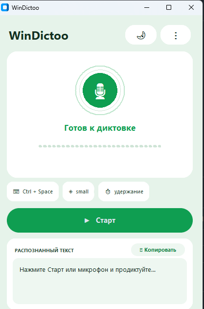

# WinDictoo


**Локальный голосовой ввод для Windows.** Зажми горячую клавишу, продиктуй,
отпусти — распознанный текст вставится в активное поле. Речь не покидает
компьютер.

Это Windows-переосмысление идеи [VoxLocal](https://github.com/romarayt/VoxLocal)
(оригинал только для macOS): та же задача, но на Windows-стеке.



## Что умеет

- **Приложение в системном трее** с глобальной горячей клавишей — по умолчанию
  **Ctrl + Space**: две клавиши, удобно одной рукой (Alt+Space занят системным
  меню Windows и не используется):
  - *удержание* (`hold`): запись, пока клавиши нажаты; распознавание после отпускания;
  - *переключение* (`toggle`): нажал — начал, нажал ещё раз — остановил.
- **Локальное распознавание** через
  [faster-whisper](https://github.com/SYSTRAN/faster-whisper) (CTranslate2),
  на CPU с int8-квантизацией. Сейчас в списке языков — русский, английский,
  немецкий и автоопределение; Whisper понимает намного больше языков, список
  в настройках можно расширить под любой из них.
- **Необязательное улучшение текста** (пунктуация, регистр, слова-паразиты)
  через **локальный Ollama**. Если он недоступен или вернул ерунду — вставляется
  исходная расшифровка. Диктовка не ломается никогда.
- **Вставка в любое приложение**: буфер обмена + синтетический Ctrl+V с
  восстановлением прежнего содержимого буфера (если его тем временем не изменило
  другое приложение).
- `Esc` отменяет активную диктовку.

## Модель приватности

- Звук пишется в оперативную память, распознаётся локально и **нигде не
  сохраняется** — временных WAV-файлов на диске нет.
- **Без облачных API, ключей и аккаунтов.** Единственный сетевой запрос —
  однократная загрузка модели Whisper с Hugging Face при первом запуске.
- Ollama работает только по loopback-адресу (`127.0.0.1` / `localhost` / `::1`);
  внешние адреса отклоняются, HTTP-редиректы запрещены.
- **Нет аналитики, телеметрии и трекинга.**
- В журнале нет аудио, текстов диктовок и содержимого буфера обмена.

## Требования

- Windows 10/11, Python 3.13+, [uv](https://docs.astral.sh/uv/).
- ~500 МБ на модель `small` (скачивается автоматически при первом запуске).
- Опционально: [Ollama](https://ollama.com) с instruct-моделью
  (например, `ollama pull qwen2.5:3b`).

## Запуск

WinDictoo — обычное оконное приложение. После установки запускается **двойным
кликом** по ярлыку **WinDictoo** на рабочем столе или в меню Пуск — открывается
окно с состоянием, кнопкой проверки и настройками. Консоль не нужна.

Первый запуск: зажми **Ctrl + Space**, продиктуй, отпусти — текст
вставится в активное поле. Окно можно свернуть в трей (значок микрофона);
из трея — открыть снова, настройки или выход.

## Сборка программы (.exe)

Готовый `dist\WinDictoo\WinDictoo.exe` — самодостаточный (Whisper внутри, ~260 МБ).
Пересобрать с нуля:

```powershell
uv sync                                                   # зависимости
uv run python packaging/make_icon.py                      # иконка
uv run pyinstaller packaging/WinDictoo.spec --noconfirm --distpath dist --workpath build
powershell -ExecutionPolicy Bypass -File packaging/install_shortcuts.ps1  # ярлыки
```

Первое распознавание скачает модель Whisper (~500 МБ) в
`%LOCALAPPDATA%\WinDictoo\models`.

### Запуск из исходников (для разработки)

```powershell
uv run windictoo          # с консолью и логами
uv run windictoo -v       # подробный лог
```

## Первый запуск

При первом старте открывается **мастер настройки**: приветствие → проверка
микрофона (с индикатором уровня) → выбор и загрузка модели → горячая клавиша →
пробная диктовка → готово. Повторно открыть его можно в
**Настройки → Конфиденциальность → «Показать мастер настройки снова»**.

## Как это работает

- **Реальная вставка** — по горячей клавише: ставите курсор в поле (Word,
  браузер, чат), зажимаете **Ctrl + Space**, говорите, отпускаете —
  текст печатается туда, где стоял курсор. Окно WinDictoo при этом может быть
  свёрнуто в трей.
- Кнопка **🎤 Проверить** в окне только **показывает** распознанный текст в самом
  окне (для проверки микрофона и модели) — она ничего не вставляет.

## Настройки

Интерфейс — тёмная тема на CustomTkinter: круглый индикатор микрофона с
анимированным эквалайзером уровня, скруглённые карточки и акцентные кнопки.

Кнопка **⋮** в окне открывает вкладки:

- **Основные** — горячая клавиша (захват нажатием), режим удержание/переключение,
  перехват клавиши, способ вставки (печать в поле / буфер+Ctrl+V), автозапуск.
- **Распознавание** — модель Whisper, язык речи, число потоков CPU, кнопка
  «Загрузить модель сейчас».
- **Улучшение** — включение Ollama, адрес, модель, кнопка «Проверить».
- **Приватность** — что и как обрабатывается, журнал, мастер настройки, о программе.

Способ вставки по умолчанию — **печать в активное поле** (`SendInput`, не трогает
буфер обмена). Если приложение её не принимает, переключитесь на **буфер+Ctrl+V**.

Клавиша хоткея **перехватывается** и не доходит до приложения, поэтому Пробел в
`Ctrl+Space` не двигает курсор и не печатает пробелы, пока вы диктуете. Если
это где-то мешает, снимите галочку «Не пропускать клавишу в приложение» в
Настройки → Общие.

Изменения применяются сразу. Всё хранится в
`%LOCALAPPDATA%\WinDictoo\config.json` (можно править и вручную).

## Модели Whisper

| Модель | Размер | Скорость / качество |
|---|---|---|
| `tiny` | ~75 МБ | самая быстрая, черновое качество |
| `base` | ~145 МБ | быстрая |
| `small` | ~485 МБ | **рекомендуется** (баланс) |
| `medium` | ~1.5 ГБ | медленнее, точнее |
| `large-v3` | ~3 ГБ | самая точная, тяжёлая для CPU |

Для i5 без дискретной видеокарты `small` на `int8` — оптимум.

## Разработка

```powershell
uv run pytest -m "not integration"   # быстрые юнит-тесты
uv run pytest -m integration         # реальный прогон Whisper на синтезе речи
uv run python tests/smoke_launch.py  # headless-проверка трея, хоткея и сессии
uv run python tests/smoke_type.py    # печать текста в поле (нужен интерактивный стол)
```

## Известные ограничения

- Распознавание идёт после остановки записи (без потокового результата).
- Вставка через синтетический Ctrl+V — в редких приложениях, блокирующих
  синтетический ввод, текст останется в буфере (вставьте вручную).
- CPU-only: `large-v3` на слабых машинах может быть медленной; берите `small`.
- Поля паролей: вставка сработает как обычный Ctrl+V — приложение не различает
  защищённые поля (в отличие от macOS-оригинала).

## Лицензия

MIT — см. [LICENSE](LICENSE). Используйте, меняйте и распространяйте свободно,
включая коммерческое использование.
