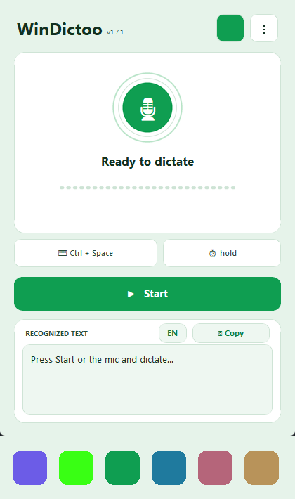

# WinDictoo

🇬🇧 **English** | 🇷🇺 [Русский](README.ru.md)


**Local voice dictation for Windows.** Hold a hotkey, speak, release —
the recognized text is inserted into the focused field. Your voice never
leaves the computer.

This is a Windows-native reimagining of [VoxLocal](https://github.com/romarayt/VoxLocal)
(the original is macOS-only): same idea, built on the Windows stack.



Several color themes to choose from (the swatch in the header) — dark,
geek-black, light-green, light-blue, dusty rose, chocolate & gold.

## Install

**[⬇ Download the installer](https://github.com/nowoandi/WinDictoo/releases/latest)** —
grab **`WinDictoo-Setup-<version>.exe`** from the release page and
double-click it: a minute later WinDictoo is in your Start menu and on
the desktop. No terminal, no admin rights, no Python — everything is
bundled. Updates install the same way on top (or right from the app:
Settings → Privacy → "Check for updates").

The same page also has no-install variants, if you prefer those:

- **`WinDictoo-<version>-portable.exe`** — a single self-contained file:
  run it and dictate; slower to start since it unpacks itself on every
  launch.
- **`WinDictoo-<version>-win64.zip`** — the same app as a folder: unzip
  and run the `WinDictoo.exe` inside.

The only later download is the speech model (~500 MB) on first run.

## What it does

- **System-tray app** with a global hotkey — **Ctrl + Space** by default:
  two keys, comfortable to hold with one hand (Alt+Space is taken by the
  Windows system menu and isn't used):
  - *hold*: records while the keys are held; transcribes on release;
  - *toggle*: press once to start, press again to stop.
- **Local recognition** via
  [faster-whisper](https://github.com/SYSTRAN/faster-whisper) (CTranslate2),
  CPU-only with int8 quantization. The language list includes auto-detect,
  Russian, English, German, French, Spanish, Chinese, Turkish, and Armenian;
  the list is easy to extend to any language Whisper understands. On first
  run the language defaults to the Windows system language — change it
  freely afterwards in Settings, or with the quick-switch button right in
  the main window (see "Settings" below).
- **Optional text refinement** (punctuation, casing, filler words) via a
  **local Ollama** instance. If it's unavailable or returns nonsense, the
  raw transcript is used instead — dictation never breaks.
- **Insertion into any application**: clipboard + synthetic Ctrl+V, with the
  previous clipboard contents restored afterwards (unless another app
  changed them in the meantime).
- `Esc` cancels an active dictation.

## Privacy model

- Audio is captured into RAM, recognized locally, and **never saved
  anywhere** — no temporary WAV files touch disk.
- **No cloud APIs, keys, or accounts.** The only network request is a
  one-time download of the Whisper model from Hugging Face on first run.
- Ollama is only ever contacted over loopback (`127.0.0.1` / `localhost` /
  `::1`); external addresses are rejected and HTTP redirects are refused.
- **No analytics, telemetry, or tracking.**
- The log never contains audio, dictation text, or clipboard contents.

## Requirements

- Windows 10/11; ~500 MB for the `small` model (downloaded automatically
  on first run).
- Optional: [Ollama](https://ollama.com) with an instruct model (e.g.
  `ollama pull qwen2.5:3b`).
- Python 3.13+ and [uv](https://docs.astral.sh/uv/) — **only for building
  from source**. The ready builds from
  [Releases](https://github.com/nowoandi/WinDictoo/releases/latest) need
  neither.

## Running it

WinDictoo is an ordinary windowed application. After installing, launch it
by **double-clicking** the **WinDictoo** shortcut on the desktop or in the
Start menu — a window opens with status, a test button, and settings. No
console required.

First run: hold **Ctrl + Space**, speak, release — the text lands in the
focused field. The window can be minimized to the tray (the mic icon); from
the tray you can reopen it, open settings, or quit.

## Building the app (.exe)

The prebuilt `dist\WinDictoo\WinDictoo.exe` is self-contained (Whisper
included, ~260 MB). To rebuild from scratch:

```powershell
uv sync                                                   # dependencies
uv run python packaging/make_icon.py                      # icon
uv run pyinstaller packaging/WinDictoo.spec --noconfirm --distpath dist --workpath build
powershell -ExecutionPolicy Bypass -File packaging/install_shortcuts.ps1  # shortcuts
```

The first transcription downloads the Whisper model (~500 MB) to
`%LOCALAPPDATA%\WinDictoo\models`.

### Running from source (for development)

```powershell
uv run windictoo          # with a console and logs
uv run windictoo -v       # verbose logging
```

## First run

On first launch a **setup wizard** opens: welcome → microphone check (with
a level indicator) → model selection and download → hotkey → test
dictation → done. You can reopen it any time from **Settings → Privacy →
"Show the setup wizard again"**.

## How it works

- **Real insertion** — via the hotkey: place the cursor in a field (Word, a
  browser, a chat app), hold **Ctrl + Space**, speak, release — the text is
  typed right where the cursor was. The WinDictoo window itself can be
  minimized to the tray while this happens.
- The **🎤 Test** button in the window only **shows** the recognized text in
  the window itself (to check the microphone and model) — it never
  inserts anything.

## Settings

The interface uses CustomTkinter: a round mic indicator with an animated
level equalizer, rounded cards, and accent buttons.

The **⋮** button in the window opens the tabs:

- **General** — hotkey (capture by pressing it), hold/toggle mode, key
  suppression, insertion method (type into field / clipboard+Ctrl+V),
  autostart, color theme, **interface language**.
- **Recognition** — Whisper model, speech language, CPU thread count, a
  "Load model now" button.
- **Refinement** — enabling Ollama, its address, model, a "Check" button.
- **Privacy** — what and how data is handled, the log, the setup wizard,
  about.

Interface language and speech-recognition language are independent
settings: the former changes the app's own text (buttons, tabs, dialogs —
across 8 languages: ru/en/de/fr/es/zh/tr/hy), the latter only changes what
language Whisper listens for. The recognition language can also be switched
quickly without opening Settings at all — via the language-code button
(**EN**/**RU**/…) next to "Copy" above the recognized text.

The default insertion method is **typing into the focused field**
(`SendInput`, doesn't touch the clipboard). If an application doesn't
accept it, switch to **clipboard+Ctrl+V**.

The hotkey's main key is **suppressed** and never reaches the focused app,
so Space in `Ctrl+Space` doesn't move the caret or type spaces while you're
dictating. If that gets in the way somewhere, uncheck "Don't pass the key
to the app" in Settings → General.

Changes apply immediately. Everything is stored in
`%LOCALAPPDATA%\WinDictoo\config.json` (which can be hand-edited too).

## Whisper models

| Model | Size | Speed / quality |
|---|---|---|
| `tiny` | ~75 MB | fastest, rough quality |
| `base` | ~145 MB | fast |
| `small` | ~485 MB | **recommended** (balanced) |
| `medium` | ~1.5 GB | slower, more accurate |
| `large-v3` | ~3 GB | most accurate, heavy on CPU |

For an i5 with no discrete GPU, `small` at `int8` is the sweet spot.

## Development

```powershell
uv run pytest -m "not integration"   # fast unit tests
uv run pytest -m integration         # real Whisper run against synthesized speech
uv run python tests/smoke_launch.py  # headless check of tray, hotkey, and a session
uv run python tests/smoke_type.py    # typing into a field (needs an interactive desktop)
```

## Known limitations

- Recognition happens after recording stops (no streaming result).
- Insertion via synthetic Ctrl+V — in the rare application that blocks
  synthetic input, the text stays in the clipboard (paste it manually).
- CPU-only: `large-v3` can be slow on weaker machines; use `small` instead.
- Password fields: insertion behaves like a normal Ctrl+V — the app can't
  tell protected fields apart (unlike the macOS original).

## License

MIT — see [LICENSE](LICENSE). Use, modify, and distribute freely, including
commercially.
