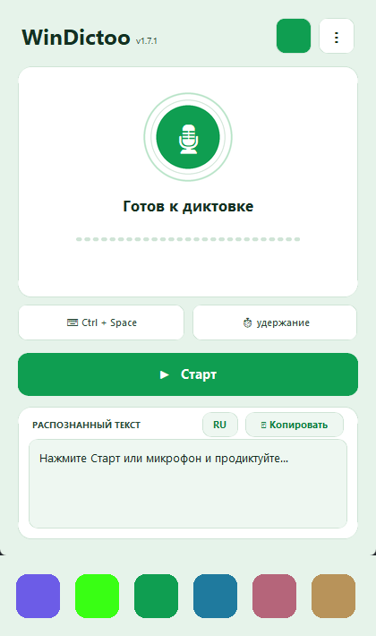

# WinDictoo

Эта страница: 🇬🇧 [English](README.md) | 🇷🇺 **Русский**


**Языки интерфейса:** Русский · English · Deutsch · Français · Español ·
中文 · Türkçe · Հայերեն.
**Распознавание речи:** русский (GigaAM v3), 25 европейских языков
(Parakeet v3) или 99 языков через Whisper — см.
[Модели распознавания](#модели-распознавания).

**Локальный голосовой ввод для Windows.** Зажми горячую клавишу, продиктуй,
отпусти — распознанный текст вставится в активное поле. Речь не покидает
компьютер.

Это Windows-переосмысление идеи [VoxLocal](https://github.com/romarayt/VoxLocal)
(оригинал только для macOS): та же задача, но на Windows-стеке.



Несколько цветовых тем на выбор (значок в шапке окна) — тёмная, гик-чёрная,
светло-зелёная, светло-синяя, альтроза, шоколад с золотом.

## Установка

**[⬇ Скачать установщик](https://github.com/nowoandi/WinDictoo/releases/latest)** —
на странице релиза возьми **`WinDictoo-Setup-<версия>.exe`**, запусти его
двойным кликом — и через минуту WinDictoo появится в меню «Пуск» и на
рабочем столе. Ни терминала, ни прав администратора, ни Python — внутри
уже есть всё. Обновления ставятся так же поверх (или прямо из приложения:
Настройки → Приватность → «Проверить обновления»).

### Windows покажет предупреждение — это нормально

При первом запуске скачанного файла появится синее окно **«Система Windows
защитила ваш компьютер»**. Нажми маленькую ссылку **«Подробнее»** под
текстом, а затем кнопку **«Выполнить в любом случае»**.

Это не вирус и не ошибка. Так Windows встречает **любую** программу, автор
которой не купил платный сертификат издателя (около 300–500 € в год).
WinDictoo его не покупает — код открыт, любой может посмотреть, что внутри.
Предупреждение появляется **один раз на компьютер**: дальнейшие обновления
приложение ставит само (Настройки → Приватность → «Проверить обновления»)
и этого окна больше не показывает.

Там же лежит вариант без установки — для тех, кому так удобнее:

- **`WinDictoo-<версия>-win64.zip`** — приложение папкой: распакуй и
  запускай `WinDictoo.exe` внутри.

Портативная сборка одним файлом больше не выкладывается. Она распаковывала
свои ~108 МБ во временную папку при каждом запуске — старт получался
медленным и дёрганым, — и её легко было спутать с установщиком.

Единственная докачка — модель распознавания при первом запуске: от 216 МБ
(GigaAM v3) до 3 ГБ (Whisper large-v3), смотря какую выбрать.

## Что умеет

- **Приложение в системном трее** с глобальной горячей клавишей — по умолчанию
  **Ctrl + Space**: две клавиши, удобно одной рукой (Alt+Space занят системным
  меню Windows и не используется):
  - *удержание* (`hold`): запись, пока клавиши нажаты; распознавание после отпускания;
  - *переключение* (`toggle`): нажал — начал, нажал ещё раз — остановил.
- **Локальное распознавание** на CPU с int8-квантизацией, на выбор двумя
  движками: [faster-whisper](https://github.com/SYSTRAN/faster-whisper)
  (CTranslate2) для моделей Whisper либо
  [onnx-asr](https://github.com/istupakov/onnx-asr) для **GigaAM v3**
  (русский, и заметно лучше Whisper `small` на нём) и **Parakeet v3**
  (25 европейских языков). Подробности — в разделе «Модели распознавания».
  В списке языков — автоопределение, русский,
  английский, немецкий, французский, испанский, китайский, турецкий и
  армянский; список легко расширяется под любой язык, который понимает
  Whisper. При первом запуске язык сам подставляется по языку системы
  Windows — дальше можно свободно сменить в настройках, а также быстрой
  кнопкой прямо в главном окне (см. «Настройки» ниже).
- **Необязательное улучшение текста** (пунктуация, регистр, слова-паразиты)
  через **локальный Ollama**. Если он недоступен или вернул ерунду — вставляется
  исходная расшифровка. Диктовка не ломается никогда.
- **Вставка в любое приложение**: буфер обмена + синтетический Ctrl+V с
  восстановлением прежнего содержимого буфера (если его тем временем не изменило
  другое приложение).
- `Esc` отменяет активную диктовку.

## Модель приватности

- Звук пишется в оперативную память, распознаётся локально и **нигде не
  сохраняется** — временных WAV-файлов на диске нет.
- **Без облачных API, ключей и аккаунтов.** Единственный сетевой запрос —
  однократная загрузка модели Whisper с Hugging Face при первом запуске.
- Ollama работает только по loopback-адресу (`127.0.0.1` / `localhost` / `::1`);
  внешние адреса отклоняются, HTTP-редиректы запрещены. Модели с меткой
  `:cloud` отклоняются тоже: они выполняются на серверах Ollama, и одной
  проверки адреса тут мало — она бы прошла, а текст всё равно ушёл бы наружу.
  При выборе такой модели улучшение отключается (вставляется исходная
  расшифровка), о чём написано в Настройках → Улучшение.
- **Нет аналитики, телеметрии и трекинга.**
- В журнале нет аудио, текстов диктовок и содержимого буфера обмена.

## Требования

- Windows 10/11; от 216 МБ до 3 ГБ на модель распознавания, смотря какую
  выбрать (скачивается автоматически при первом запуске).
- Опционально: [Ollama](https://ollama.com) с instruct-моделью
  (например, `ollama pull qwen2.5:3b`).
- Python 3.13+ и [uv](https://docs.astral.sh/uv/) — **только для сборки из
  исходников**. Готовым сборкам со страницы
  [Releases](https://github.com/nowoandi/WinDictoo/releases/latest) они не
  нужны.

## Запуск

WinDictoo — обычное оконное приложение. После установки запускается **двойным
кликом** по ярлыку **WinDictoo** на рабочем столе или в меню Пуск — открывается
окно с состоянием, кнопкой проверки и настройками. Консоль не нужна.

Первый запуск: зажми **Ctrl + Space**, продиктуй, отпусти — текст
вставится в активное поле. Окно можно свернуть в трей (значок микрофона);
из трея — открыть снова, настройки или выход.

## Сборка программы (.exe)

Готовый `dist\WinDictoo\WinDictoo.exe` — самодостаточный (Whisper внутри, ~260 МБ).
Пересобрать с нуля:

```powershell
uv sync                                                   # зависимости
uv run python packaging/make_icon.py                      # иконка
uv run pyinstaller packaging/WinDictoo.spec --noconfirm --distpath dist --workpath build
powershell -ExecutionPolicy Bypass -File packaging/install_shortcuts.ps1  # ярлыки
```

Первое распознавание скачает выбранную модель в
`%LOCALAPPDATA%\WinDictoo\models`.

### Сборка релиза

```powershell
& "$env:LOCALAPPDATA\Programs\Inno Setup 6\ISCC.exe" /DAppVersion=1.8.0 packaging\WinDictoo-Setup.iss
tar -a -c -f dist\WinDictoo-1.8.0-win64.zip -C dist WinDictoo
```

Архив собирать через `tar`, а **не** `Compress-Archive`. Windows PowerShell
5.1 работает на .NET Framework, где и `Compress-Archive`, и
`ZipFile.CreateFromDirectory` пишут имена записей через обратный слэш.
Формат ZIP требует прямого, и распаковщики на таком архиве часто выдают
плоскую кучу файлов со странными именами вместо папки — а `.exe` в ней
не найти.

Выкладывать ровно два файла: установщик и этот архив. Портативного `.exe`
быть не должно — почему, написано в `packaging/WinDictoo-Setup.iss`.

### Запуск из исходников (для разработки)

```powershell
uv run windictoo          # с консолью и логами
uv run windictoo -v       # подробный лог
```

## Первый запуск

При первом старте открывается **мастер настройки**: приветствие → проверка
микрофона (с индикатором уровня) → выбор и загрузка модели → горячая клавиша →
пробная диктовка → готово. Повторно открыть его можно в
**Настройки → Конфиденциальность → «Показать мастер настройки снова»**.

## Как это работает

- **Реальная вставка** — по горячей клавише: ставите курсор в поле (Word,
  браузер, чат), зажимаете **Ctrl + Space**, говорите, отпускаете —
  текст печатается туда, где стоял курсор. Окно WinDictoo при этом может быть
  свёрнуто в трей.
- Кнопка **🎤 Проверить** в окне только **показывает** распознанный текст в самом
  окне (для проверки микрофона и модели) — она ничего не вставляет.

## Настройки

Интерфейс — тёмная тема на CustomTkinter: круглый индикатор микрофона с
анимированным эквалайзером уровня, скруглённые карточки и акцентные кнопки.

Кнопка **⋮** в окне открывает вкладки:

- **Основные** — горячая клавиша (захват нажатием), режим удержание/переключение,
  перехват клавиши, способ вставки (печать в поле / буфер+Ctrl+V), автозапуск,
  тема оформления, **язык интерфейса**.
- **Распознавание** — модель распознавания, язык речи, число потоков CPU,
  кнопка «Загрузить модель сейчас».
- **Улучшение** — включение Ollama, адрес, модель, кнопка «Проверить».
- **Приватность** — что и как обрабатывается, журнал, мастер настройки, о программе.

Язык интерфейса и язык распознавания речи — независимые настройки: первый
меняет текст самого приложения (кнопки, вкладки, диалоги — на 8 языках:
ru/en/de/fr/es/zh/tr/hy), второй — только на каком языке Whisper распознаёт
речь. Быстро сменить язык распознавания можно и без захода в настройки —
кнопкой с кодом языка (**RU**/**EN**/…) рядом с «Копировать» над распознанным
текстом.

Способ вставки по умолчанию — **печать в активное поле** (`SendInput`, не трогает
буфер обмена). Если приложение её не принимает, переключитесь на **буфер+Ctrl+V**.

Клавиша хоткея **перехватывается** и не доходит до приложения, поэтому Пробел в
`Ctrl+Space` не двигает курсор и не печатает пробелы, пока вы диктуете. Если
это где-то мешает, снимите галочку «Не пропускать клавишу в приложение» в
Настройки → Общие.

Изменения применяются сразу. Всё хранится в
`%LOCALAPPDATA%\WinDictoo\config.json` (можно править и вручную).

## Модели распознавания

Доступны два движка, и список в **Настройках → Распознавание** сводит их
воедино.

| Модель | Размер | Языки | Скорость |
|---|---|---|---|
| **GigaAM v3** | ~216 МБ | только русский | ~20× реального времени |
| **Parakeet v3** | ~639 МБ | 25 европейских (ru, en, de, fr, es и др.) | ~15× реального времени |
| Whisper `tiny` | ~75 МБ | 99 | самая быстрая из Whisper, черновое качество |
| Whisper `base` | ~145 МБ | 99 | быстрая |
| Whisper `small` | ~485 МБ | 99 | ~3× реального времени, баланс |
| Whisper `medium` | ~1.5 ГБ | 99 | медленнее, точнее |
| Whisper `large-v3` | ~3 ГБ | 99 | самая точная, тяжёлая для CPU |

Скорость измерена на прогретом кэше, только CPU, 4 потока, на одной и той же
русской фразе длиной 3,2 секунды; GigaAM, Parakeet и Whisper `small`
распознали её одинаково верно.

**GigaAM v3** и **Parakeet v3** работают на onnxruntime (через
[onnx-asr](https://github.com/istupakov/onnx-asr)), а не на Whisper, и обе
сами расставляют пунктуацию и заглавные буквы. Настройку языка ни одна из
них не принимает: GigaAM знает только русский, Parakeet определяет язык сам —
поэтому при их выборе список языков гаснет с пояснением. **Если вы диктуете
по-русски, GigaAM здесь лучший выбор**: она вдвое меньше Whisper `small` и в
несколько раз быстрее.

Whisper остаётся единственным вариантом для языков, которых нет у первых двух
(китайский, турецкий, армянский и ещё семь десятков), и единственным, где
язык можно задать принудительно.

## Микрофон

Открытие звукового устройства занимает 100–400 мс — ровно столько, чтобы
проглотить первый слог диктовки. Поэтому поток открывается один раз и
работает постоянно: пока вы не диктуете, последние **400 мс** звука лежат в
маленьком кольцевом буфере, и нажатие горячей клавиши начинает запись
*оттуда* — слово, начатое чуть раньше нажатия, уже записано. То же и на
другом конце: запись продолжается ещё **200 мс** после отпускания клавиши,
потому что её обычно отпускают, не договорив последнее слово.

**Настройки → Основные → «Когда микрофон открыт»** решают, насколько долго
поток остаётся живым:

- **Полминуты после** (по умолчанию) — отпускается через 30 секунд после
  диктовки, поэтому идущие подряд фразы начинаются мгновенно.
- **Всегда** — самый быстрый старт, но Windows постоянно показывает значок
  «микрофон используется», а Bluetooth-гарнитуры переключаются в режим
  гарнитуры, и музыка в них звучит хуже.
- **Только во время диктовки** — между диктовками микрофон не занят ничем, но
  ценой тех самых 100–400 мс и, возможно, обрезанного первого слова.

На модель приватности это не влияет: звук в режиме ожидания не покидает
кольцевой буфер в оперативной памяти, непрерывно затирается и пропадает при
закрытии потока.

## Разработка

```powershell
uv run pytest -m "not integration"   # быстрые юнит-тесты
uv run pytest -m integration         # реальный прогон Whisper на синтезе речи
uv run python tests/smoke_launch.py  # headless-проверка трея, хоткея и сессии
uv run python tests/smoke_type.py    # печать текста в поле (нужен интерактивный стол)
```

## Известные ограничения

- Распознавание идёт после остановки записи (без потокового результата).
- Вставка через синтетический Ctrl+V — в редких приложениях, блокирующих
  синтетический ввод, текст останется в буфере (вставьте вручную).
- CPU-only: `large-v3` на слабых машинах может быть медленной; берите GigaAM
  (для русского), Parakeet или `small`.
- Поля паролей: вставка сработает как обычный Ctrl+V — приложение не различает
  защищённые поля (в отличие от macOS-оригинала).

## Лицензия

MIT — см. [LICENSE](LICENSE). Используйте, меняйте и распространяйте свободно,
включая коммерческое использование.

Модели распознавания скачиваются во время работы и идут со своими условиями:

- OpenAI **Whisper** — MIT.
- Сбер **GigaAM v3** — MIT
  ([ONNX-сборка](https://huggingface.co/istupakov/gigaam-v3-onnx)).
- NVIDIA **Parakeet TDT 0.6B v3** — CC-BY-4.0
  ([карточка модели](https://huggingface.co/nvidia/parakeet-tdt-0.6b-v3)),
  коммерческое использование разрешено с указанием авторства.

Часть идей — постоянно открытый микрофон с буфером упреждения и сама мысль
предложить движки помимо Whisper — взята из проекта
[Handy](https://github.com/cjpais/handy) (MIT), кроссплатформенного
приложения голосового ввода на Rust.
